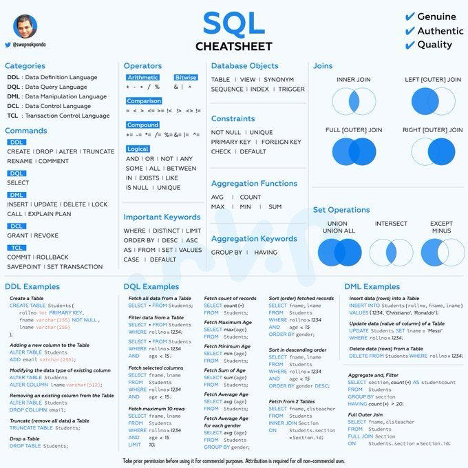

# QueryLab

**QueryLab** is a browser-based SQL playground for learning and practicing SQL through interactive challenges. Inspired by platforms like LeetCode and SQLBolt, it offers a hands-on environment where users can:

- View structured SQL challenges with sample data
- Write and execute queries directly in the browser (powered by SQLite via sql.js)
- Automatically validate query results against expected outputs
- Explore step-by-step explanations and before/after tables
- Reference a built-in cheat sheet preview while solving

---

## ✨ Features

- 🧠 20+ curated SQL challenges (Beginner to Intermediate)
- 📘 Interactive schema and table view
- ✅ Auto-validation against expected query results
- 💡 Visual breakdown of solution steps
- 💻 Runs entirely in-browser (no backend)
- 🧾 Linked cheat sheet overlay for quick SQL reference

---

## 🛠 Technologies

- HTML5 + CSS3
- JavaScript (Vanilla)
- [sql.js](https://github.com/sql-js/sql.js) for SQLite execution
- JSON-based challenge system
- Font Awesome for header icons

---

## 🚀 Live Demo

Check it out live:  
👉 [https://rgerjeki.github.io/querylab](https://rgerjeki.github.io/querylab)

---

## 🔗 Connect

- [Portfolio](https://rgerjeki.github.io)
- [GitHub](https://github.com/rgerjeki)
- [LinkedIn](https://www.linkedin.com/in/rgerjeki/)

---

## 📁 File Overview

| File | Purpose |
|------|---------|
| `index.html` | Main interface layout |
| `style.css` | Responsive styles and layout |
| `script.js` | Handles challenge loading, SQL validation, rendering logic |
| `challenges.json` | Full challenge dataset with schema, expected results, and answers |
| `image.png` | Cheat sheet image preview (clickable with modal zoom) |
